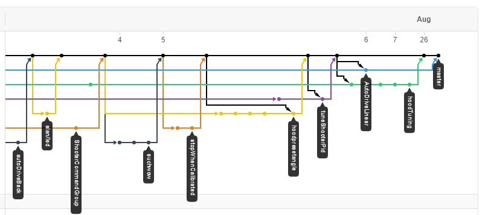
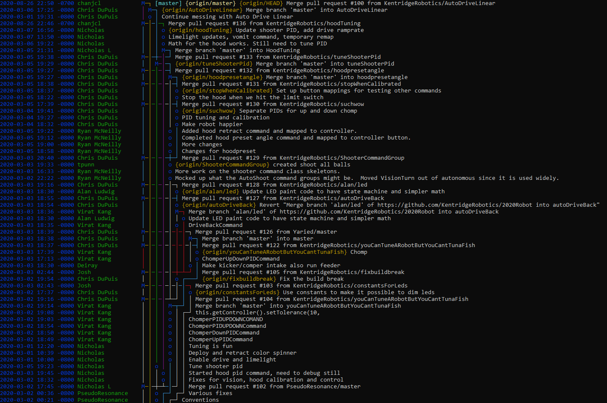
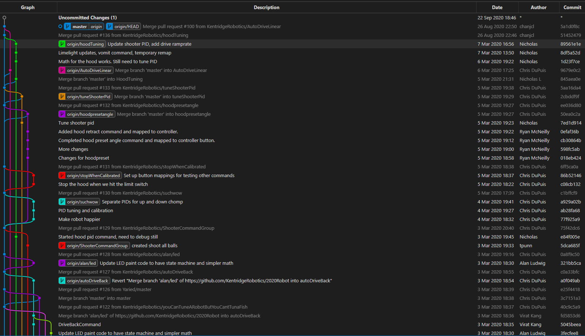

# Git Basics

## Making a commit

Creating a commit consists of a adding untracked or unstaged files to the staging
area, then committing those changes with a commit message describing what it is
that has changed.

Here's how to do this:

- [CommandLine](CommandLine/3-GitBasics.md#making-a-commit)
- [VSCode](VSCode/3-GitBasics.md#making-a-commit)
- [GitHub Desktop](GitHubDesktop/3-GitBasics.md#making-a-commit)

## Commit Messages

- [CommandLine](CommandLine/3-GitBasics.md#commit-messages)
- [VSCode](VSCode/3-GitBasics.md#commit-messages)
- [GitHub Desktop](GitHubDesktop/3-GitBasics.md#commit-messages)

## The Commit Graph

We've discussed what the commit graph is [previously](1-WhatIsGit.md), however,
it can be beneficial to have a visual idea of what is going on.

Below are a few different visualizations, from some different tools, of the commit
graph of a single repository.

### GitHub: Insights > Network

### Tig

### VSCode

### GitHub Desktop

GitHub Desktop currently does not currently implement this feature.

See the [relevant issue](https://github.com/desktop/desktop/issues/1634).
