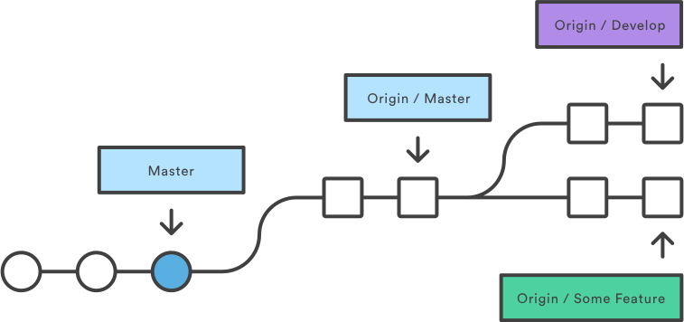
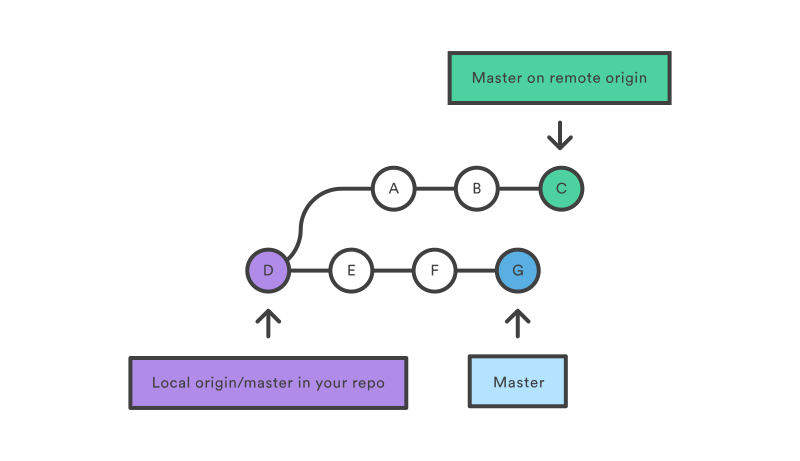
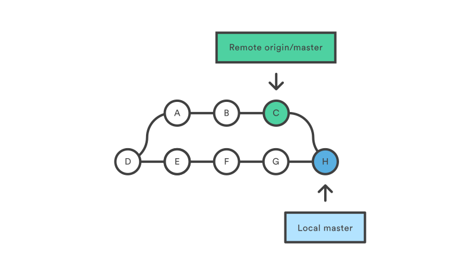
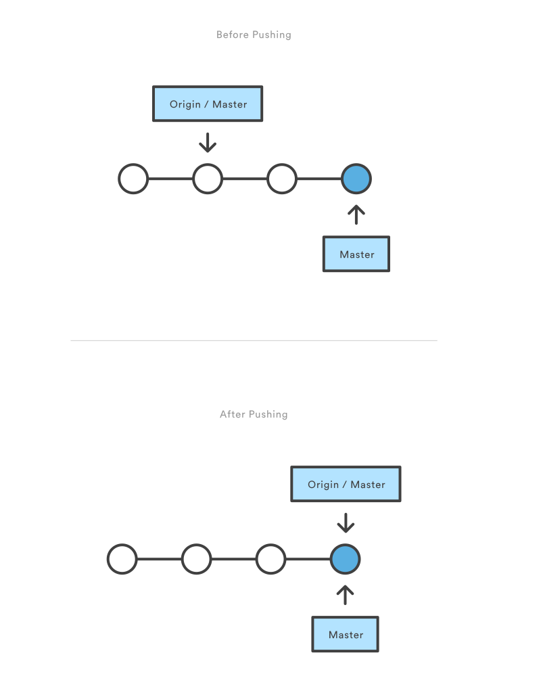

# Remotes

A remote is a Git repository hosted somewhere on the internet and is used as a
separate place to backup your repository and make it available elsewhere.

Even though anyone can create a remote and host it themselves, the following are
services most commonly used for Git remotes. This list is non-exhaustive.

- GitHub
- GitLab
- Bitbucket
- SourceForge

To interact with a remote, you will utilize the `fetch`, `pull`, and `push`
operations. In order for those operations to function, you will need to have
defined the remote by giving it a name and defining where it is. Remotes can
either utilize HTTP or SSH. For the latter you will need an SSH key registered
with the remote, but will not need to input your password for every operation!

The state of the remote is represented on your local machine as branches prefixed
with `<remote name>/`. The most common remote name is `origin` and the rest of
this document will assume that your remote is named `origin`.

## Fetching

A fetch from the remote updates what your local machine believes the state of
the remote to be, but will not affect the state of your local branches or files.

For example, if the branch `my-awesome-feature` is updated on the remote, a fetch
will reflect that in the local branch of `origin/my-awesome-feature`.

In the following diagram, the squares are from new remote branches, while the
circles are from local branches.

Follow the instructions for how to fetch changes with your tool of choice:

- [Command Line](CommandLine/6-Remotes.md#fetching)
- [VSCode](VSCode/6-Remotes.md#fetching)
- [GitHub Desktop](GitHubDesktop/6-Remotes.md#fetching)

## Pulling

A pull is the combination of two different operations, a fetch followed by a
merge. This is typically used to update your local branch to be the same as
what is on the remote.

Before pulling:

After pulling:

Follow the instructions for how to pull changes with your tool of choice:

- [Command Line](CommandLine/6-Remotes.md#pulling)
- [VSCode](VSCode/6-Remotes.md#pulling)
- [GitHub Desktop](GitHubDesktop/6-Remotes.md#pulling)

## Pushing

A push is the opposite of a pull and takes the changes of your local branch
and updates the remote with them.

Follow the instructions for how to push changes with your tool of choice:

- [Command Line](CommandLine/6-Remotes.md#pushing)
- [VSCode](VSCode/6-Remotes.md#pushing)
- [GitHub Desktop](GitHubDesktop/6-Remotes.md#pushing)
